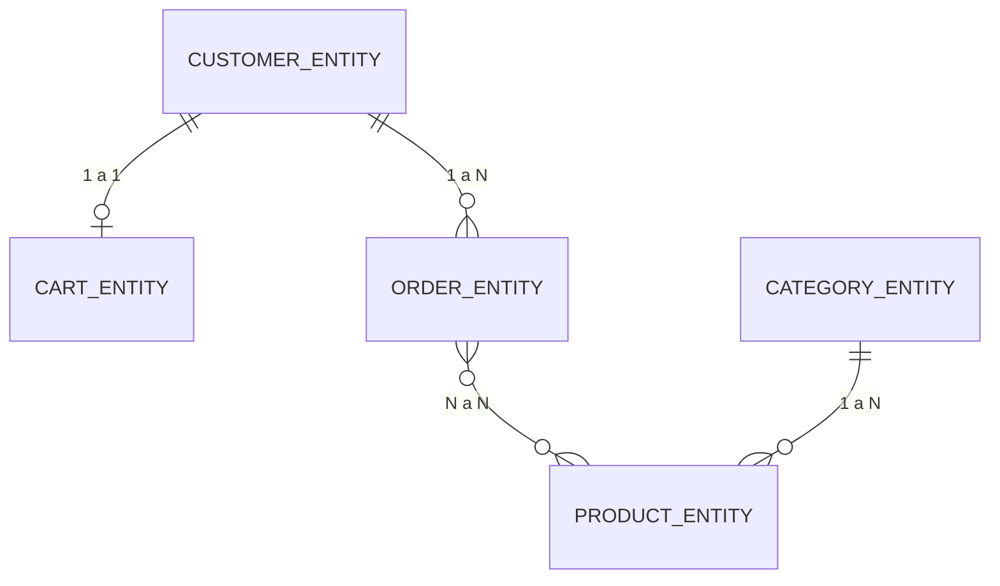

# Relaciones JPA en las Entidades de Persistencia

Las clases de entidad (`CartEntity`, `CategoryEntity`, `CustomerEntity`, `OrderEntity`, `ProductEntity`) representan la estructura de la base de datos y sus relaciones mediante anotaciones de JPA. A continuación, se explica cada relación y se ilustra con un diagrama de entidad-relación.

---

## 1. Entidades y Relaciones

### 1.1. `CustomerEntity`
Representa a los clientes y es el punto central de varias relaciones.

---

### 1.2. `CartEntity`
- Tiene una relación **OneToOne** con `CustomerEntity` (cada carrito pertenece a UN cliente y cada cliente tiene UN carrito).
  ```java
  @OneToOne
  @JoinColumn(name = "cliente_id")
  private CustomerEntity cliente;
  ```

---

### 1.3. `OrderEntity`
- Relación **ManyToOne** con `CustomerEntity` (un cliente puede tener muchos pedidos, pero cada pedido solo pertenece a un cliente).
  ```java
  @ManyToOne
  @JoinColumn(name = "cliente_id")
  private CustomerEntity cliente;
  ```
- Relación **ManyToMany** con `ProductEntity` (un pedido puede tener muchos productos y un producto puede estar en muchos pedidos).
  ```java
  @ManyToMany
  @JoinTable(
      name = "pedido_producto",
      joinColumns = @JoinColumn(name = "pedido_id"),
      inverseJoinColumns = @JoinColumn(name = "producto_id")
  )
  private Set<ProductEntity> productos;
  ```

---

### 1.4. `ProductEntity`
- Relación **ManyToOne** con `CategoryEntity` (muchos productos pueden pertenecer a una misma categoría).
  ```java
  @ManyToOne(fetch = FetchType.LAZY)
  @JoinColumn(name = "categoria_id")
  private CategoryEntity categoria;
  ```

---

### 1.5. `CategoryEntity`
- Relación **OneToMany** con `ProductEntity` (una categoría puede tener muchos productos).
  ```java
  @OneToMany(mappedBy = "categoria")
  private List<ProductEntity> productos;
  ```

---

## 2. Diagrama Entidad-Relación Simplificado



**Leyenda:**
- `||--o|` → One to One
- `||--o{` → One to Many
- `}o--o{` → Many to Many

---

## 3. Explicación Visual

- **Cliente y Carrito:** Cada cliente tiene un solo carrito, y viceversa.
- **Cliente y Pedido:** Un cliente puede tener muchos pedidos, pero cada pedido solo puede estar asociado a un cliente.
- **Pedido y Producto:** Relación N:M, gestionada por una tabla intermedia (`pedido_producto`).
- **Producto y Categoría:** Cada producto pertenece a una sola categoría, pero una categoría puede tener muchos productos.

---

## 4. Resumen de Relaciones

| Entidad Principal    | Relación      | Entidad Relacionada   | Tipo de Relación   |
|----------------------|--------------|-----------------------|--------------------|
| CustomerEntity       | 1 a 1        | CartEntity            | OneToOne           |
| CustomerEntity       | 1 a N        | OrderEntity           | OneToMany          |
| OrderEntity          | N a M        | ProductEntity         | ManyToMany         |
| ProductEntity        | N a 1        | CategoryEntity        | ManyToOne          |
| CategoryEntity       | 1 a N        | ProductEntity         | OneToMany          |

---

## 5. Conclusión

Las relaciones en estas entidades siguen buenas prácticas de modelado con JPA, permitiendo una estructura robusta y coherente para operaciones sobre clientes, carritos, pedidos, productos y categorías. El uso de anotaciones como `@OneToOne`, `@ManyToOne`, `@OneToMany` y `@ManyToMany` asegura que las asociaciones sean claras y fácilmente navegables desde el código fuente.
